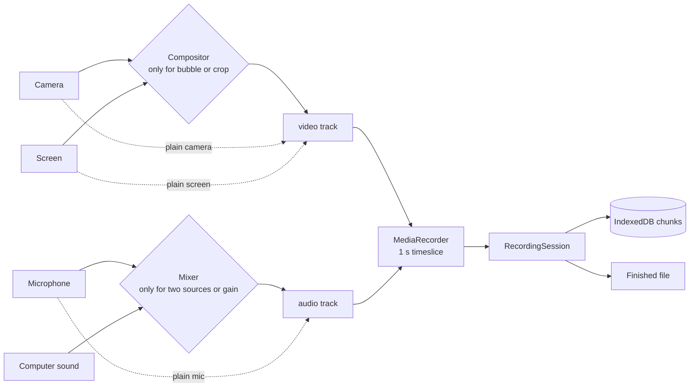

# Architecture

AV Recorder is a static web app that records camera, screen and audio entirely in the browser. This document explains how it is put together, why the key choices were made, and what happens when things fail, so it can be changed safely.

## Principles

1. **Never lose a recording.** Every design choice is judged first by what happens when something fails mid-take.
2. **Record the plainest stream possible.** Canvas compositing and audio mixing are used only when a feature needs them. A raw camera track is the most reliable input MediaRecorder has.
3. **Side features are optional.** The meter, thumbnails, wake lock, floating window, library, service worker and diagnostics can each fail without stopping a recording.
4. **Detect features; don't assume browsers.** Capabilities are checked before use, with a plainer fallback after each failure. User-agent checks appear only where no feature test exists (for example, phones exposing a screen-capture function that never works).
5. **No build, no runtime dependencies, nothing leaves the device.** Plain scripts on a static host. It works from `file://`, offline and behind a strict Content-Security-Policy.

## Files

| File | Responsibility |
|---|---|
| `index.html`, `style.css` | Markup and styles. The shared WeCanUseAI footer block is identical across tools: don't edit it here alone. |
| `js/version.js` | The version. The page shows it, and the service worker names its cache after it. |
| `js/diagnostics.js` | On-device event log (ring buffer) and the Help → Diagnostics report. Loads first to catch every error. |
| `js/util.js` | Platform detection, formatting, downloads, sharing, toasts, error messages. |
| `js/settings.js` | Preferences in `localStorage`, validated against defaults on every load. |
| `js/store.js` | IndexedDB: recordings and their chunks. Fails soft when unavailable. |
| `js/formats.js` | Chooses a MIME type and bitrate the browser can actually record. |
| `js/webm-duration.js` | EBML patcher that writes the missing Duration into WebM headers. |
| `js/wav.js` | Decodes any recording's audio and writes 16-bit WAV. |
| `js/audio-engine.js` | Web Audio: level meters, and mixing the microphone with computer sound. |
| `js/compositor.js` | Canvas compositing (camera bubble, aspect crop), clocked by a Web Worker. |
| `js/session.js` | One recording: MediaRecorder, chunked storage, timing, finalizing, crash recovery. |
| `js/sources.js` | Getting, holding and releasing camera, microphone and screen. No UI. |
| `js/teleprompter.js`, `js/pip.js` | Teleprompter, and floating controls (Document Picture-in-Picture). |
| `js/meter-view.js`, `js/settings-panel.js`, `js/review.js`, `js/library.js` | UI components. |
| `js/app.js` | The coordinator: state machine, preview pipeline, recording flow, rendering. |
| `js/icons.js` | Generated icon sprite (`node tools/build-icons.mjs`). |
| `sw.js`, `manifest.webmanifest`, `icons/` | Offline support and installability. |

Scripts are classic scripts sharing one namespace, `window.AVR`, loaded in dependency order at the end of `<body>`. There are no modules, so the app also runs from `file://`, where browsers refuse ES modules.

## State machine

| From | Event | To |
|---|---|---|
| idle | Start preview (button, or automatically when permission was granted before) | starting |
| starting | Sources ready | preview |
| starting | Refused, cancelled or failed | idle (with the reason shown) |
| preview | Record | countdown, or recording if the countdown is off |
| countdown | Finished | recording |
| countdown | Esc, or Record again | preview |
| recording | Pause, or a phone interrupts the camera | paused |
| paused | Resume, or the interruption ends | recording |
| recording / paused | Stop, source ended, out of space | saving |
| recording | Encoder error | saving, then straight back to recording as the next part |
| saving | Saved | review |
| saving | Nothing was captured (a split-second take) | preview |
| review | New recording | idle, then preview for camera and audio modes |

- `app.render()` is the only place that maps state to what is on screen.
- Every async start carries a token (`startToken`). A permission prompt that resolves after the person has moved on releases its stream instead of taking over the UI.
- Mode switches keep what is still useful. For example, Screen ⇄ Screen + Cam keeps the shared screen.

## Recording pipeline



- **Why mix:** MediaRecorder records only the first audio track, so microphone and computer sound must become one track.
- **Why a worker clock:** in a hidden tab, `requestAnimationFrame` stops and timers drop to 1 Hz. Measured with the tab hidden, rAF gave 0 frames in 6 s and timers 6, while worker messages kept 30 fps. `tests/background.test.mjs` guards this.
- **Why 1 s chunks:** a crash loses at most one second, and IndexedDB handles one write per second easily.

## Stored data

IndexedDB database `av-recorder`, version 1:

- **`recordings`** (key `id`) holds `{id, name, mode, kind, mimeType, ext, width, height, createdAt, updatedAt, durationMs, size, chunkCount, status: 'recording'|'complete', thumb, recovered?, incomplete?}`.
- **`chunks`** (key `[recId, seq]`) holds `{recId, seq, blob}`. A recording's file is its chunks concatenated in `seq` order.

Each chunk and the recording's running totals are written in a single transaction, so the metadata never claims more media than is on disk.

`localStorage` holds `avr.settings.v1` (preferences) and `avr.log.v1` (the last 80 diagnostics events). Neither contains recordings, script text or device names. Script text lives in settings, but the report excludes it.

To change the schema, bump `DB_VERSION` in `store.js` and migrate in `onupgradeneeded`. Never drop the `chunks` store: it may hold someone's only copy of a recording.

## Failure modes

| Failure | What happens | Covered by |
|---|---|---|
| Tab closed, browser crash, battery dies | Chunks are already on disk. On the next visit, `recoverAll()` finalizes them (patches the duration, marks "Recovered"). A Web Lock keeps a recording that is still live in another tab untouched. | `app.test`: recovers a recording |
| Encoder error mid-take | Part 1 is saved and recording continues as part 2 of the same take. Capped at 5 parts, each needing more than 3 s. | `resilience.test`: recorder failure |
| Storage write fails (disk full) | Falls back to memory with a warning. At 300 MB (phone) or 2 GB (computer) it stops and saves before the tab can be killed. | `resilience.test`: memory runs short |
| Storage stalls | Chunks stay in memory until confirmed, and each wait in the save path is capped at 20 s. Saving never hangs, and the file is complete. | `resilience.test`: storage stalls |
| Space running low | Warns before recording (under 10 min left) and during it (3 min), using the measured byte rate. | `resilience.test`: nearly full |
| IndexedDB unavailable (private modes) | Records in memory. Review says "download it now". | `app.test`: refuses storage |
| Screen share ended / device unplugged | Saves what was recorded. A lost camera bubble or microphone lets the take continue. | Manual (browser UI) |
| Phone camera interrupted (app switch, call) | Pauses on track `mute` or page hide, and resumes when it returns. | Manual (device) |
| Stop pressed within ~0.2 s | Nothing to save. Keeps the preview and says "too short". No empty entry is left. | `resilience.test`: split second |
| Saved device gone, or impossible constraints | Retries with plainer constraints and forgets the stale device. | Code path in `sources.js` |
| Unknown browser quirks | Recorder options fall back step by step: full → no bitrates → browser default. | `formats` and `session` fallbacks |
| Corrupt saved settings | Each field is validated against defaults, and bad values are dropped. | `app.test`: corrupt settings |
| Any uncaught error | Logged to diagnostics. Recording is unaffected. | `resilience.test`: diagnostics |

## Tuning

| Choice | Value | Reason |
|---|---|---|
| Video bitrate | YouTube's recommended upload rates by long side (1080p30 8 Mbps, 60 fps 12 Mbps, 4K30 35 Mbps). Standard ×0.5, Max ×1.6. | Enough for YouTube's re-encode without waste. Portrait uses the long side. |
| Audio bitrate | 192 kbps (128 at Standard) | Transparent for voice with AAC or Opus. |
| Keyframe interval | 2 s (Chrome 126+) | Fast seeking in players and editors, for a few percent of size. |
| `contentHint` | Screen `detail` (`motion` at 60 fps), camera `motion`, mic `speech` | Screen text stays sharp when the encoder has to compromise. |
| Format "Auto" | MP4 H.264/AAC, then WebM VP9, then VP8. Generic `video/mp4` first only on Safari. | MP4 opens in every editor and phone. Elsewhere a generic `video/mp4` can mean VP9-in-MP4, which many editors reject. |
| Chunk size | 1 s | At most 1 s lost in a crash. Cheap to store. |
| Memory ceiling | 300 MB phone / 2 GB computer | Below where mobile browsers kill tabs. Chrome pages large blobs to disk on computers. |
| Storage wait cap | 20 s | Far above a healthy save (tens of ms), short enough that no one waits on a stalled store. |
| Meter | Peak level, 60 dB range, clip at −1 dBFS, hot at −9 | Matches what editors show. Clipping is visible before it's audible. |

## Browser support

- **Chrome/Edge (desktop):** everything, including tab or system audio and floating controls.
- **Firefox:** everything except computer sound and floating controls.
- **Safari (macOS):** everything except computer sound and floating controls. Records MP4.
- **Phones:** camera and audio. Browsers can't capture a phone's screen, so screen modes are hidden and the help explains why.
- **Minimum:** MediaRecorder support (iOS 14.3+). Anything older gets a clear banner rather than a broken page.

Automated tests run in Chromium. Safari and Firefox rely on feature detection and fallbacks: test them by hand before a release (checklist below).

## Security and privacy

- A Content-Security-Policy allows only this site's own scripts, styles, workers and media, plus the shared favicon host. The single inline script is allowed by hash. `tests/static.test.mjs` fails if the hash or markup drifts.
- User-provided text (recording names, the script) is only ever set via `textContent`.
- There is no network use besides loading the app itself. Recordings leave the device only when the person downloads or shares them.

## Tests

```sh
cd tests && npm ci && npx playwright install chromium
npm run check          # lint + all tests; prefix npm test with `xvfb-run -a` on Linux
```

| File | Checks |
|---|---|
| `static.test.mjs` | Offline cache list vs. files the page loads. CSP hash. Every looked-up element id exists. Size budget. Version and changelog agree. |
| `unit.test.mjs` | WebM patcher, including every layout it must refuse. Bitrates. Formats. WAV bytes. Formatting and escaping. |
| `app.test.mjs` | Real recordings in every mode, pause timing, crash recovery, shortcuts, teleprompter, phone layout. |
| `resilience.test.mjs` | Encoder failure, full or stalled storage, memory ceiling, low space, split-second takes, diagnostics. |
| `offline.test.mjs` | Loads and records with the server gone (drives Chromium directly: Playwright bypasses service workers). |
| `background.test.mjs` | Frame rate while the tab is hidden (drives Chromium directly under xvfb: Playwright disables background throttling). |

On a timeout, `waitState()` reports the app, session and recorder state, visible toasts and recent diagnostics events. An intermittent failure should explain itself on the first occurrence.

## Making changes

- **New script:** add it to `index.html` and to `SHELL` in `sw.js`. The static test fails if you forget either.
- **New setting:** add a default (and allowed values) in `settings.js`, a control in `index.html`, and a binding in `settings-panel.js`.
- **New icon:** add its Phosphor name to `tools/build-icons.mjs` and run the script.
- **Inline script changes:** update the `sha256` in the CSP. The static test prints the mismatch.
- **Anything touching recording:** add a failure-path test in `resilience.test.mjs`, not just the happy path.

## Release checklist

1. Bump `js/version.js` and add a `CHANGELOG.md` section. The static test enforces this pairing.
2. `npm run check` passes locally, and CI is green.
3. Manual pass on a real iPhone (Safari) and a real Android phone: camera recording, pause, app-switch auto-pause, download, share.
4. Manual pass in desktop Safari and Firefox: screen and Screen + Cam, with the tab in the background.
5. Merge to `main`. GitHub Pages deploys it, and returning visitors pick it up on their next load (network-first service worker).
